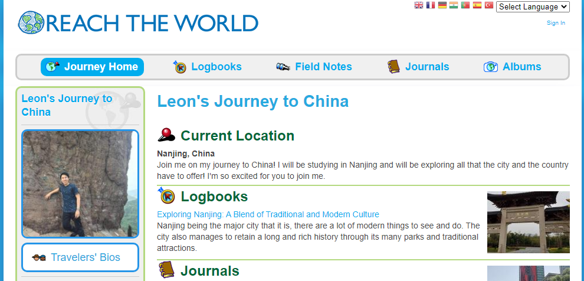

I've had the time to reflect on what I truly gained from my experience in 2019 studying abroad in China as part of the Chinese Flagship Capstone year program. Although it may sound cliché, attending this program was really a once-in-a-lifetime opportunity that has defined a part of my college experience. I will detail some of my thoughts and actions throughout this journey.

Never have I imagined that I would be spending a year in China. In February 2019, I did just that, and even then, I was skeptical if the experience would be worth it. In the weeks and months before there were definitly a lot of hurdles to overcome. I was worried if I would have enough money to fund for it, what if my medicine wouldn't make it past customs or if my Chinese was even good enough. With the help of my teachers, advisors and some luck, I found a certified translator to translate my doctor's notes, got more funding awarded from Gilman Scholarship and so that gave me assurance that everything will go through smoothly.

## Arrival in Nanjing

Even finding flights had some bumps. A week before, my flight had been canceled because of an airport strike going on in Taiwan. I had to rebook to another flight that connected from Beijing to Nanjing. When the day had arrived, the flight had been delayed a couple times. But all these bumps in the road right at the start only made me more determined to succeed in my last study abroad.

I made it to Beijing after 15 hours on the plane and immediately transferred flights to Nanjing. Once I arrived, it was about 9 am in the morning, making my way to the airport taxis and struggling to tell the taxi driver the address I wanted to go, slowly adjusting to everything being in Chinese from now on. I arrive to the flagship office a bit frazzled from the lack of sleep and excitement. Once I got to the office, I was greeted by some familiar and unfamiliar faces. Students from all over the U.S. flagship schools were here and I had met some of them before from previous summer study abroads. Being the last student to arrive, everyone else had already gotten set up and so the next few hours for me was to go get a new Chinese phone number, bank account, and housing to rent. With these being done, it was time for classes to start!

## Life as a Chinese student and resident

I quickly found my groove in adapting to this new environment, I would check out all the local eateries and found the ones that I enjoyed the most. I got to know a lot of locals with my frequenting of the places. It was a very exciting first couple months and even with a twinge of homesickness hitting in the third month. I enjoyed interacting with everyone I met. 

A big part of my semester, I spent creating content as a world travler volunteer for an organization called Reach The World. 

## Learning and Working

## Looking toward the path ahead

It is unfortunate that many students after me had their experiences cut short due to the current pandemic and my hope is that they can continue on this journey in the near future. 
